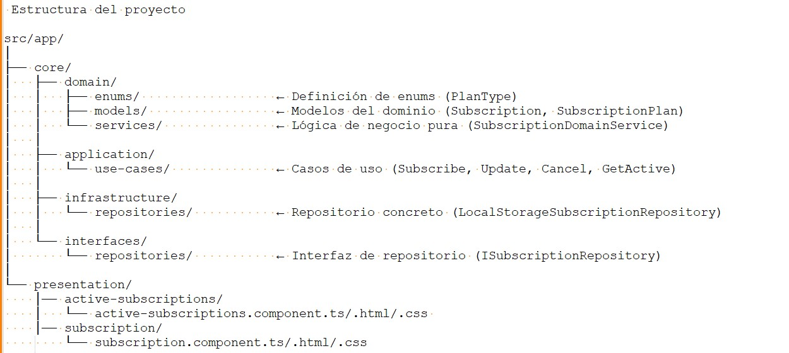

# Gestor de suscripciones

***
**Tabla de Contenido**
1. [Introducci�n](#id1)
2. [Levantando la Aplicaci�n](#id2)
    * 2.1. [Pre-Requisitos](#id2.1)
    * 2.2. [Ejecutando la Aplicaci�n](#id2.2)
    * 2.3. [Variables de Entorno](#id2.3)    
3. [Probando los servicios](#id3)
4. [Arquitectura de Aplicaciones](#id4)
    * 4.1. [Arquitectura Hexagonal](#id4.1)

## 1. Introducci�n
***
Este proyecto contiene la soluci�n del reto t�cnico de desarrollo de software en satrack,
un modelo de suscripciones para una plataforma de streaming, construido en Angular, basado en una arquitectura Clean Architecture y un enfoque de dise�o de software centrado en el dominio del negocio. [** DDD**](#id4) 

La distribuci�n de m�dulos y paquetes del proyecto se basa en Clean Architecture

## 2. Levantando la Aplicaci�n

La aplicaci�n permite ejecutarse demanera local, clonandoce el proyecto, una vez clonando utilizaremos los siguientes comandos 

* npm install

luego para levantar el proyecto en un navegador 
* ng -serve -o

### 2.1. Pre-Requisitos
* Tener instalado [**Visual code**](https://code.visualstudio.com/).
* Tener instalado [**.node.js**](https://nodejs.org/es/download).
* instalar Angular cli 

### 3  Aplicaci�n de principios solid

* Inversi�n dependencias (DIP) : Se aplica inversi�n de dependencias debido a que se est�n usando interfaces  para realizar abstracciones y no de implementaciones ejemplo IsubscriptionRepository.

* Abierto y Cerrado (OCP): los m�dulos est�n abiertos a que puedan extender dersen sin necesidad de ser modificados, ejemplo de aplicaci�n en los casos de uso.

* principio de segregaci�n de interfaces: la interfaz es peque�a y todas sus implementaciones son usadas, es decir no existen m�todos o funciones innecesarias (IsubscriptionRepository)

* Responsabilidad �nica (SRP): cada clase tiene una �nica responsabilidad, y su implementaci�n y cuya implementaci�n de casos de uso fue realizado como lo sugiere el reto cancel-subscription.use-case, update-subscription.use-case, subscription.use-case

## 4. Patrones de dise�o

* Patr�n de repositorio: Se utiliza este patron de tipo estructural, el cual nos facilita en la abstracci�n de datos por medio de interfaz

* Strategy Pattern: Se implementa el (Patr�n de estrategia) en las funciones calculatePayment o canBeCancelled, ya que estas permiten cambiar el comportamiento o realizar calculos dinamicos segun su plan de suscripci�n que se le envie por parametros. 

* Command Patther: la implementacion podemos apreciarla en los casos de uso, debido a que solo se enfocan en realizar una unica acci�n ya sea de cancelar, actualizar o uactualizar.

* Facade: En la implementación utilizamos el patrón fachada debido a que nuestra interfaz de UI en angular manifiesta la implementación sencilla, es decir al presionar un botón o acción de la interfaz ejecuta una serie de procesos ocultos al usuario final.

* Facade: En la implementación utilizamos el patrón fachada debido a que nuestra interfaz de UI en angular manifiesta la implementación sencilla, es decir al presionar un botón o acción de la interfaz ejecuta una serie de procesos ocultos al usuario final.

* Adaptador: En la implementación utilizamos el patrón Adaptador, el cual podemos apreciar en la clase local-storage-subscription.repository debido a que esta implementando el contrato de la interfaz ISubscriptionRepository por lo cual nos permite salir de esa capa de dominio y conectarnos con fuente de datos diferente en este caso localStorage.
